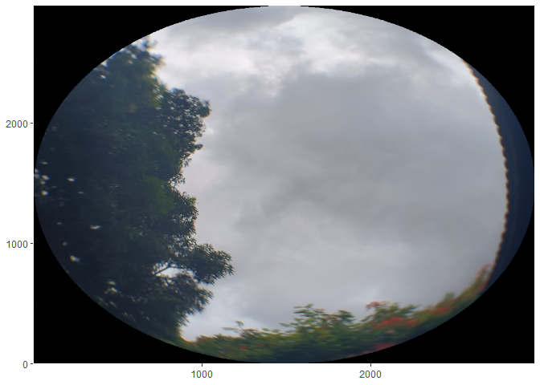
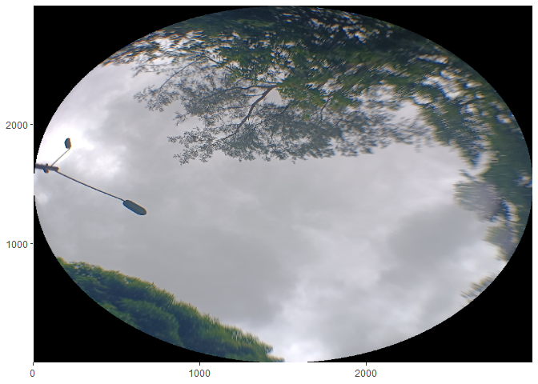
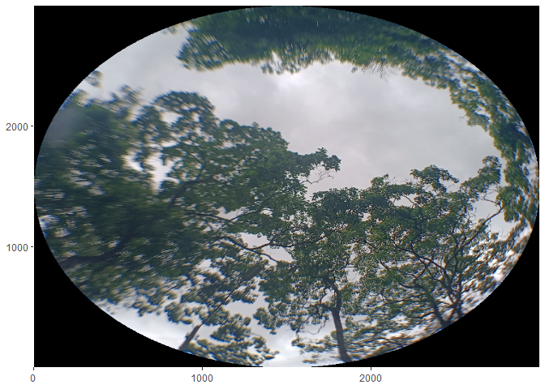
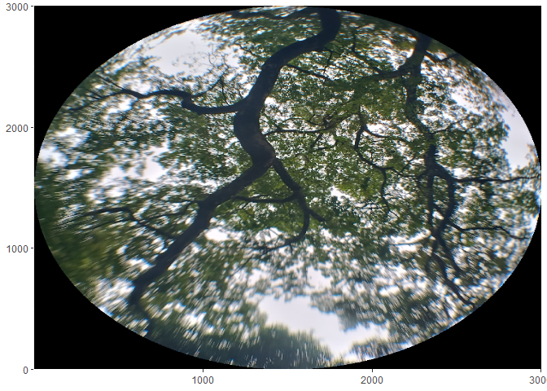
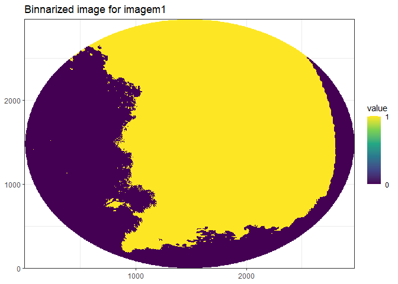
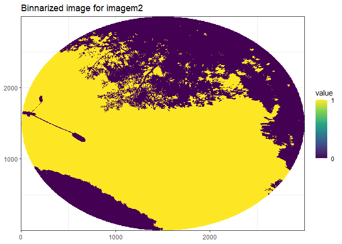
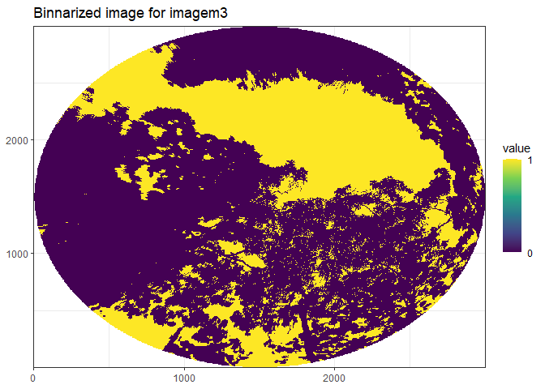
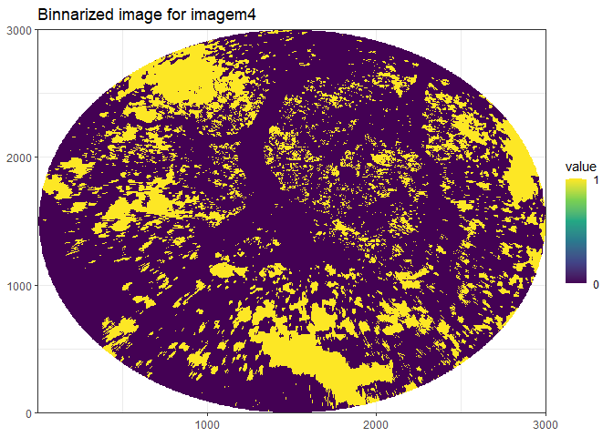

# Analysing Canopy Openness Index Analysis with R

# Required Packages

``` r
library(terra)

library(tidyverse)

library(tidyterra)

library(hemispheR)
```

# Data

## Images path

``` r
images <- list.files(path = "cropped-images", 
                     pattern = ".png")

images
```

    ## [1] "imagem1.png" "imagem2.png" "imagem3.png" "imagem4.png"

## Visualizing cannopy images through a looping

``` r
visualizing_canopy <- function(x){ 
  
  x <- paste0("cropped-images/", x)
  
  raster_bi <- terra::rast(x)
  
  ggplots <- ggplot() +
    tidyterra::geom_spatraster_rgb(data = raster_bi) +
    scale_fill_continuous(na.value = "transparent") +
    scale_x_continuous(expand = c(0, 0)) +
    scale_y_continuous(expand = c(0, 0)) 
  
  print(ggplots)
  
}

purrr::walk(images, visualizing_canopy)
```

    ## Warning: [rast] unknown extent

    ## <SpatRaster> resampled to 501264 cells.

<!-- -->

    ## Warning: [rast] unknown extent

    ## <SpatRaster> resampled to 501264 cells.

<!-- -->

    ## Warning: [rast] unknown extent

    ## <SpatRaster> resampled to 501264 cells.

<!-- -->

    ## Warning: [rast] unknown extent

    ## <SpatRaster> resampled to 501264 cells.

<!-- -->

# Calculating Canopy Openess index

## Visualizing each binarized images through a looping

``` r
canopy_visualizing <- function(x){ 
  
  path_file <- paste0("cropped-images/", x) 
  
  image_name <- stringr::str_remove(x, ".png")
  
  analy <- stringr::str_glue("Binnarized image for {image_name}") 
  
  file <- path_file  |>
    hemispheR::import_fisheye()  |>
    hemispheR::binarize_fisheye()
  
  ggplt <- ggplot() +
    tidyterra::geom_spatraster(data = file) +
    scale_fill_viridis_c(na.value = "transparent", breaks = seq(0, 1, 1)) +
    scale_x_continuous(expand = c(0, 0)) +
    scale_y_continuous(expand = c(0, 0)) +
    labs(title = analy) +
    theme_bw()
  
  print(ggplt)
  
}

purrr::walk(images, canopy_visualizing)
```

    ## It is a circular fisheye, where xc, yc and radius are 1485.5, 1485.5, 1483.5

    ## <SpatRaster> resampled to 501264 cells.

<!-- -->

    ## It is a circular fisheye, where xc, yc and radius are 1499.5, 1499.5, 1497.5
    ## <SpatRaster> resampled to 501264 cells.

<!-- -->

    ## It is a circular fisheye, where xc, yc and radius are 1499.5, 1499.5, 1497.5
    ## <SpatRaster> resampled to 501264 cells.

<!-- -->

    ## It is a circular fisheye, where xc, yc and radius are 1500, 1500, 1498
    ## <SpatRaster> resampled to 501264 cells.

<!-- -->

## Calculating opennes Index for each images through a looping

``` r
canopy_Openess <- function(x){ 
  
  path_file <- paste0("cropped-images/", x)
  
  image_name <- stringr::str_remove(x, ".png")
  
  stringr::str_glue("Cannopy Opennes Index for {image_name}:") |> 
    crayon::green() |> 
    message()
  
  raster <- path_file |>
    hemispheR::import_fisheye() |>
    hemispheR::binarize_fisheye()
  
  values_0 <- raster[raster > 0] |> 
    terra::ncell()
  
  values_all <- raster |> 
    terra::ncell()
  
  result <- values_0 / values_all
  
  print(result)
  
} 

purrr::walk(images, canopy_Openess)
```

    ## Cannopy Opennes Index for imagem1:

    ## It is a circular fisheye, where xc, yc and radius are 1485.5, 1485.5, 1483.5

    ## [1] 0.49774

    ## Cannopy Opennes Index for imagem2:

    ## It is a circular fisheye, where xc, yc and radius are 1499.5, 1499.5, 1497.5

    ## [1] 0.5004268

    ## Cannopy Opennes Index for imagem3:
    ## It is a circular fisheye, where xc, yc and radius are 1499.5, 1499.5, 1497.5

    ## [1] 0.2591377

    ## Cannopy Opennes Index for imagem4:

    ## It is a circular fisheye, where xc, yc and radius are 1500, 1500, 1498

    ## [1] 0.1944832
